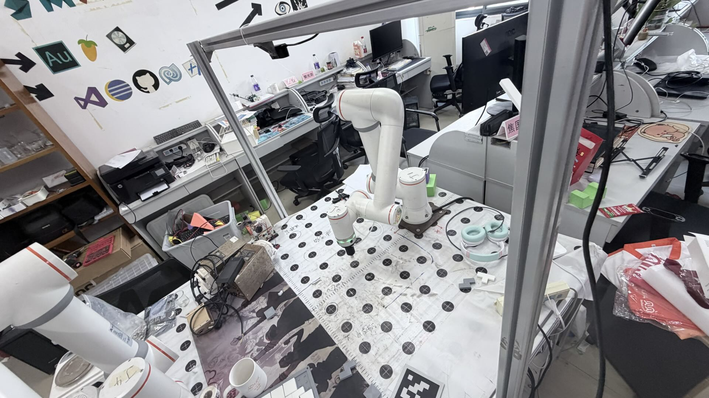
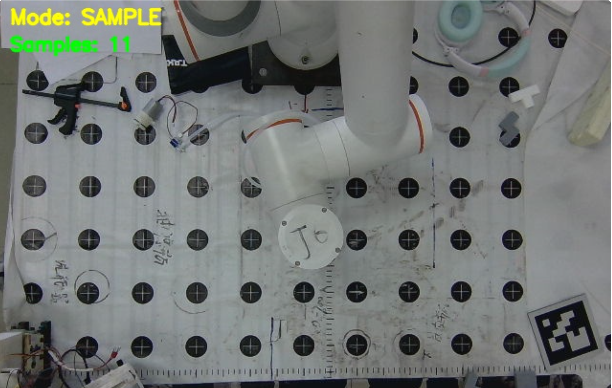
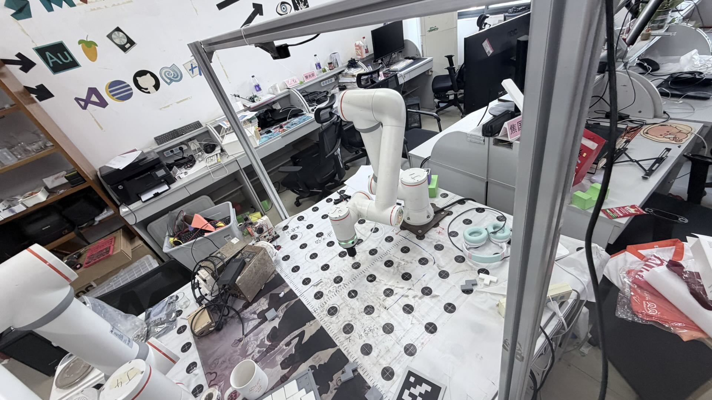

# FR3 + Gemini335 平面标定工具

这是一个给 `FR3 机械臂 + Gemini335 相机` 使用的本地平面标定工具。

它解决的问题很直接：

- 在相机图像里点击一个像素点
- 把这个点映射到 `FR3 基座坐标系` 下的平面 `x/y`
- 支持采样、拟合、验证，以及让机器人移动到预测点上方



当前项目提供两种使用方式：

- `calibrate_plane.py`
  OpenCV 窗口版，适合直接在桌面上跑
- `server.py`
  本地网页 UI，适合在浏览器里操作

## 0. 演示图片

### 0.1 相机原始画面

桌面网格和工作区在 Gemini335 俯视画面中的效果如下：



### 0.2 本地网页界面

当前项目的本地网页界面如下，可以直接在浏览器里完成采样、计算和验证：



## 1. 目录说明

- `calibrate_plane.py`
  核心标定逻辑与 OpenCV 交互版入口
- `server.py`
  本地网页服务入口
- `robot_api.py`
  FR3 最小接口封装
- `gemini_camera.py`
  Gemini335 取流与去畸变封装
- `fairino/Robot.py`
  FR3 Python SDK vendor 文件
- `templates/index.html`
  网页界面
- `static/app.js`
  网页前端交互逻辑
- `static/style.css`
  网页样式
- `planar_session.json`
  采样过程数据
- `planar_calibration_result.json`
  标定结果
- `tests/`
  无硬件单元测试

## 2. 环境准备

推荐直接使用你现有的 conda 环境。

```bash
conda activate <your_env>
pip install -r requirements.txt
```

如果你已经在某个环境里装好了 `numpy / opencv / fastapi / uvicorn / jinja2`，也可以直接运行，不一定要重新装。

## 3. 启动方式

### 3.1 网页版

推荐优先使用网页版。

```bash
python server.py
```

默认地址：

```text
http://127.0.0.1:8000
```

### 3.2 OpenCV 窗口版

```bash
python calibrate_plane.py
```

## 4. 运行前会自动做的事

程序启动后，会先连接：

- FR3 机器人
- Gemini335 相机

并且会先把机械臂末端姿态调整到：

- `RX = 180`
- `RY = 0`
- `RZ = 180`

这里默认保持当前位置 `x/y/z` 不变，只调整姿态。

## 5. 标定基本流程

推荐流程如下：

1. 手动拖动或示教 FR3，让 TCP 对准桌面一个网格点。
2. 在图像里点击这个点。
3. 保存一个采样点。
4. 重复以上步骤，建议采样 `12` 个以上，最低 `4` 个。
5. 计算标定结果。
6. 进入验证模式。
7. 再点击图像里的某个点，查看预测 `x/y`。
8. 如果确认要走位，允许机器人运动，再执行验证移动。

## 6. 网页版功能

网页里现在可以做这些事：

- 查看实时相机画面
- 点击画面选点
- 查看当前 TCP 位姿
- 保存采样点
- 撤销上一点
- 计算标定
- 进入验证模式
- 锁定验证姿态 `rx/ry/rz`
- 允许运动 / 禁止运动
- 让机器人移动到预测点上方
- 重新把姿态对正到 `180/0/180`

## 7. 验证模式姿态规则

这是当前非常重要的一条逻辑：

- 进入验证模式时，会读取当前 TCP 的 `rx/ry/rz`
- 这三个角度会被锁定成“验证姿态”
- 后续每次验证移动，都会保持这组锁定角度不变

也就是说：

- 验证模式下，机器人只改预测 `x/y`
- `z` 会移动到平面上方安全高度
- `rx/ry/rz` 始终保持进入验证模式那一刻的姿态

## 8. 数据文件

### 8.1 `planar_session.json`

保存采样过程数据，至少包括：

- `robot_ip`
- `image_width`
- `image_height`
- `grid_spacing_mm`
- `camera_calibration_reference`
- `samples`

每个 `sample` 至少包含：

- `point_id`
- `pixel_u`
- `pixel_v`
- `tcp_pose`
- `robot_x`
- `robot_y`
- `timestamp`

### 8.2 `planar_calibration_result.json`

保存标定结果，至少包括：

- `homography_pixel_to_robot`
- `homography_robot_to_pixel`
- `error_stats`
- `sample_count`
- `plane_z_mm`
- `reference_rpy_deg`

## 9. 常用命令

### 9.1 指定机器人 IP

```bash
python server.py --robot-ip 192.168.58.2
```

### 9.2 指定 Gemini335 SDK 根目录

```bash
python server.py --gemini-sdk-root /path/to/02.奥比中光-pyobbecsdk示例代码(Gemini335)
```

### 9.3 指定去畸变参数目录

```bash
python server.py --camera-calib-dir /path/to/camera_calib
```

### 9.4 指定分辨率

```bash
python server.py --width 640 --height 480 --fps 30
```

## 10. OpenCV 版热键

如果你使用 `calibrate_plane.py`，热键如下：

- `鼠标左键`
  选择当前像素点
- `s`
  保存采样点
- `u`
  撤销上一点
- `c`
  计算标定
- `v`
  切换采样/验证模式
- `m`
  允许/禁止机器人运动
- `g`
  移动到预测点上方
- `p`
  打印当前 TCP 位姿
- `q`
  保存并退出

## 11. 注意事项

- 采样阶段不会自动控制 FR3 运动，需要你手动拖动或示教到位。
- 默认验证移动只会去“预测点上方安全高度”，不会自动压到桌面。
- 当前输出的是 `FR3 基座坐标系` 下的平面 `x/y`。
- Gemini335 彩色流如果找不到你指定的分辨率，程序会自动回退到可用 profile。
- 如果网页打不开，先看终端是否有 `500` 或设备初始化报错。

## 12. 测试

```bash
pytest -q
```

当前这些测试不依赖真实硬件，主要验证：

- FR3 接口封装
- 单应矩阵拟合
- JSON 读写
- 采样与预测流程

## 13. 后续建议

如果后面继续增强，我建议优先做这几件事：

- 网页右侧加采样点表格
- 画面上显示采样点编号
- 支持删除指定采样点
- 增加“当前姿态锁定状态”的颜色提示
- 增加桌面网格自动检测
